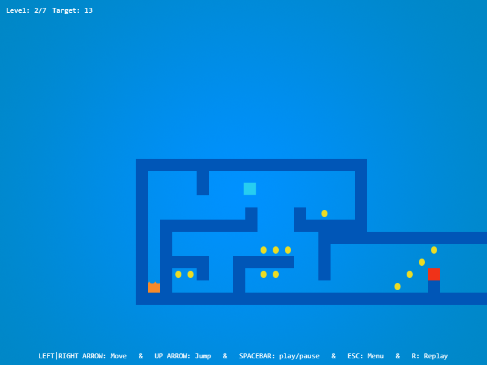
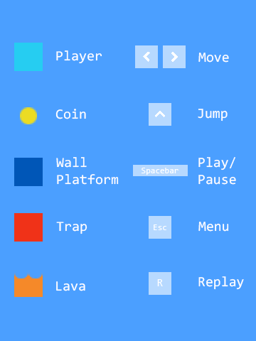

# Platform Game

A small game was made with Phaser Game Engine.



All you have to do is collect coin. Once you collect all them, you will passed current level.



Good luck for you!

[Play it now!](https://vuanhhaogk.github.io/apps/platform/index.html)

[See more info!](https://vuanhhaogk.github.io/apps/platform/info.html)

## Dev

```
$ git clone https://github.com/vuanhhaogk/Platform-Game.git
$ cd Platform-Game
[...Platform-Game] $ npm i
[...Platform-Game] $ npm gulp watch
```

## License

MIT
